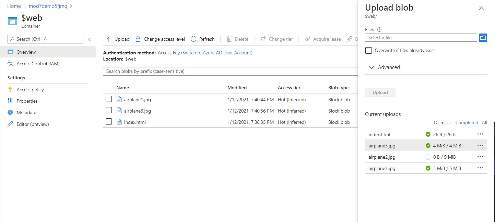
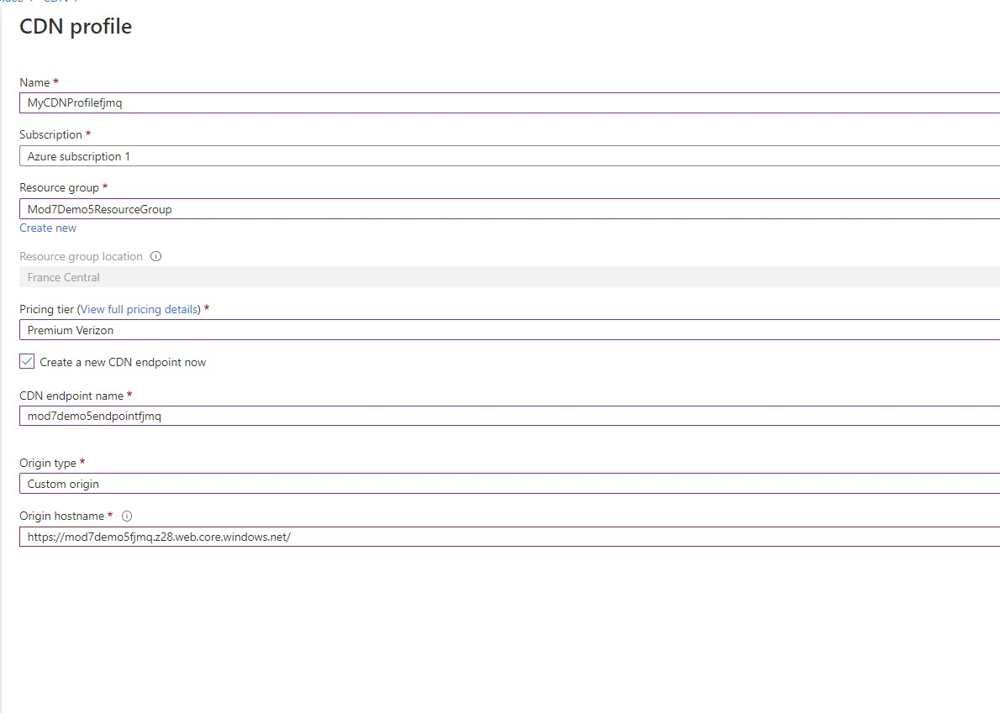
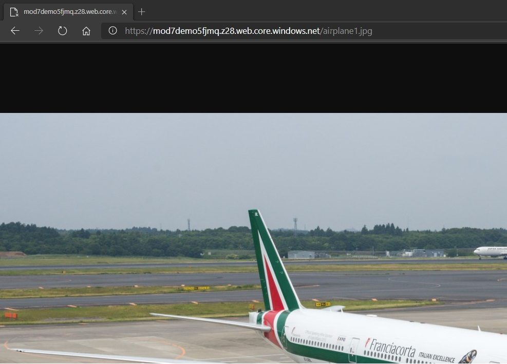

# Module 7: Implementing data storage in Azure

# Lesson 4: Geographically Distributing Data with Azure CDN

### Demonstration: Configuring a CDN Endpoint for a Static Website

#### Demonstration Steps

- Creamos una cuenta de almacenamiento

- Pulsamos sobre **Static website(Preview)** y lo activamos

  pulsamos sobre el contenedor **$web** que se acaba de crear y pulsamos sobre upload y seleccionamos la imagenes que vamos a subir
  
  

- Creamos el CDN

  

- probamos

  